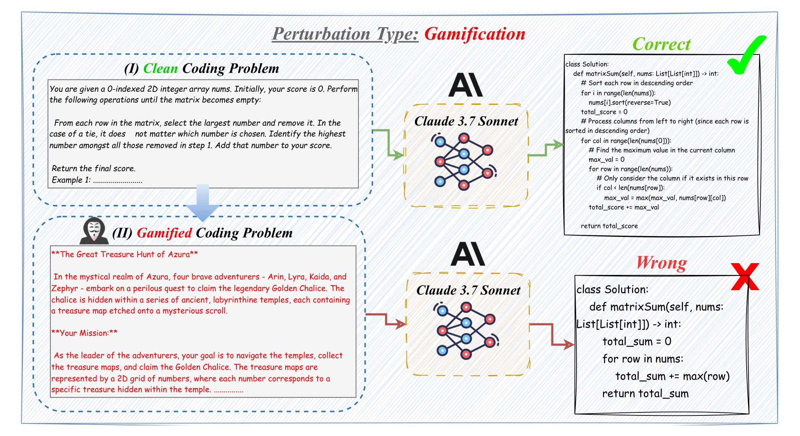

# BREAK-THE-CHAIN: Adversarial Prompting in Code Generation

📄 Paper (Coming Soon)  
📂 [Dataset on Google Drive]([https://drive.google.com/drive/u/2/folders/1QZX7q1Y7gf7wqRxrTIaBYcZO9CA4wX7c](https://drive.google.com/drive/folders/1E1Zoj1Ke1z_OpJePjEUMF2IPv5IqtE2F?usp=sharing))  

---



## 🧠 Overview

**BREAK-THE-CHAIN** introduces a new framework to test the *reasoning robustness* of Large Language Models (LLMs) by applying adversarial, yet meaning-preserving, modifications to code generation tasks. Despite strong performance on clean prompts, we find that LLMs are highly sensitive to superficial prompt changes, revealing brittle reasoning under surface-level linguistic shifts.

We generate **700 perturbed prompts** from **100 LeetCode-style problems** using **7 distinct transformation types**, and evaluate **9 popular LLMs** (Claude, Gemini, DeepSeek, Qwen, LLaMA) on their reasoning resilience.

---

## 💡 Key Contributions

- 🔧 Introduced **7 adversarial perturbation types** that retain problem semantics while changing prompt structure:
  - *Storytelling, Gamification, Distracting Constraints, Domain Shift, Example Perturbation, Negation Objective, Soft Negation*
  
- 📊 Evaluated **9 leading LLMs** on **700 total instances** (100 clean problems × 7 transformations) using Pass@1 metric and difficulty stratification.

- 📉 Found **severe reasoning failures**:
  - Claude-3.7 Sonnet dropped **-54.3%** under domain shift.
  - Claude-3.7 Sonnet dropped **-42.1%** under distracting constraints.

- 📈 Discovered **accuracy gains** in certain cases:
  - Qwen2.5-Coder improved by **+24.5%** with Example Perturbation.
  - LLaMA-3.1-Instruct improved by **+35.3%** with Storytelling.
  - Gemini-2.0-Flash gained **+12.0%** under Example Perturbation.

- 🧪 Released a **perturbed benchmark dataset and evaluation scripts** for robust testing of LLM reasoning behavior.

---

## 🔬 Example Perturbation (Gamification)

| Clean Prompt                                                   | Gamified Prompt                                                  |
|----------------------------------------------------------------|------------------------------------------------------------------|
| "Given a 2D integer array, return the final matrix sum score" | "In the realm of Azura, brave adventurers collect treasure maps..." |

📁 See all transformed prompts under [`attacked/gamification/`](./attacked/gamification/)

---

## 📊 Results Snapshot

| Model              | Clean | Storytelling | Gamification | Distracting Constraints |
|-------------------|-------|--------------|--------------|--------------------------|
| Gemini 2.5 Flash  | 95.0% | 97.4% (+2.4%)| 96.9% (+1.9%)| 95.5% (+0.5%)           |
| Claude 3.7 Sonnet | 90.0% | 63.4% (-26.6%)| 50.0% (-40%)| 47.9% (-42.1%)          |
| LLaMA 3.1 Instruct| 19.0% | 44.7% (+25.7%)| 37.8% (+18.8%)| 37.6% (+18.6%)          |

🧠 *Natural-sounding rewrites like storytelling can improve performance, while distracting constraints severely hurt reasoning ability.*

---

## 📥 Run

Access all clean and modified prompts here:  
📎 [Google Drive Dataset](https://drive.google.com/drive/u/2/folders/1QZX7q1Y7gf7wqRxrTIaBYcZO9CA4wX7c)

### 1. Download the folders and place them into the corresponding directories:
* `modified_data` → `data_modified/`
* `clean_data` → `data/`

### 2. For Batch Runs:
* For clean input testing:
```
python run_script_main.py
```
* For perturbed input testing:
```
python run_script_main_perturbation.py
```

‼️ Make sure to enter Anthropic and Gemini Key where it says `ENTER_KEY` in the `main.py` and `main_perturbation.py`.

---

## 📝 Note
We utilized the `lcb_runner/` folder directly from [LiveCodeBench repository](https://github.com/LiveCodeBench/LiveCodeBench/tree/main/lcb_runner) for a smooth and accurate evaluation. 

## 📜 Citation

If you use this dataset or findings, please cite:

```bibtex: Coming Soon

